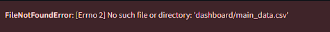

# Technical Exercise Result (Data Scientist 3)

### Project name: Submission Analisis Data Bike Sharing

## Project Summary

- Memberikan dokumentasi menggunakan **text cell** pada notebook (.ipynb) untuk menjelaskan **setiap tahapan analisis data**.
- Membuat visualisasi data yang baik dan efektif
- File Notebook masih belum bisa dijalankan karrena masih terdapat kesalahan dalam pemanggilan file pada [dashboard.py](http://dashboard.py) karena penamaan yang tidak disesuaikan dengan foldering file.
- Perhatikan penggunaan visualisasi data pada project yang kamu kerjakan, penggunaan visualisasi data yang terlalu banyak dapat memecahkan fokus dan pesan yang ingin disampaikan melalui visualisasi data yang digunakan. Untuk menghindari hal tersbut kamu bisa menghapus penggunaan visualisasi data yang tidak diperlukan dan fokus pada visualisasi utama yang ingin disampaikan.

Sebagai tambahan kamu bisa menerapkan saran berikut.

- Deploy dashboard ke dalam **streamlit cloud**.
- **Menerapkan teknik analisis lanjutan** seperti *RFM analysis*, *geoanalysis*, *clustering*, dll. (Tanpa menggunakan algoritma machine learning).

Kedepannya kamu bisa mencoba mengembangkan kemampuanmu dengan lebih explore lagi mengenai streamlit. Kamu bisa mempelajari : **[Streamlit cheat sheet](https://docs.streamlit.io/library/cheatsheet)**.

Berikut beberapa framework visualisasi data yang dapat kamu pelajari :

- **[The McCandless Method](https://www.informationisbeautiful.net/visualizations/what-makes-a-good-data-visualization/)**
- **[Kaiser Fung’s Junk Charts Trifecta Checkup](https://junkcharts.typepad.com/junk_charts/junk-charts-trifecta-checkup-the-definitive-guide.html)**

Agar kemampuan analisa datamu menjadi lebih luas, kamu bisa mempelajari lebih dalam tentang materi berikut :

- **[Pandas cheat sheet](https://pandas.pydata.org/Pandas_Cheat_Sheet.pdf)**
- **[Matplotlib cheat sheet](https://matplotlib.org/cheatsheets/_images/cheatsheets-1.png)**
- **[Seaborn cheat sheet](https://www.kaggle.com/code/themlphdstudent/cheat-sheet-seaborn-charts)**

# Code Review

```python
day_clean_df = pd.read_csv("dashboard/main_data.csv")
hour_df = pd.read_csv("data/hour.csv")
```



> Perhatikan directory data yang digunakan, file dashboard dan file lainnya terletak pada folder yang sama. Kamu perlu menambahkan perintah cd dashboard pada readme karena file [dashboard.py](http://dashboard.py) terlrtak di dalam folder dashboard, kemudian perbaiki path directory yang masih salah pada dashboard.py.
>