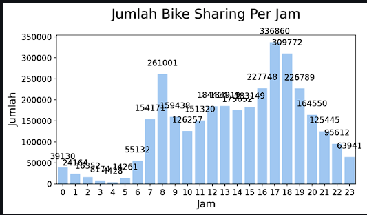

# Technical Exercise Result (Data Scientist 4)

### Project name: Submission Analisis Data Bike Sharing

## Project Summary

- Memberikan dokumentasi menggunakan **text cell** pada notebook (.ipynb) untuk menjelaskan **setiap tahapan analisis data**.
- Membuat visualisasi data yang baik dan efektif
- File notebook tidak dapat dijalankan karena penggunaan absolute path. Kamu sebaiknya menggunakan relative path untuk membaca dataset yang digunakan.
- Hasil visualisasi data masih kurang rapi dan dapat diperbaiki lagi.

Sebagai tambahan kamu bisa menerapkan saran berikut.

- Deploy dashboard ke dalam **streamlit cloud**.
- **Menerapkan teknik analisis lanjutan** seperti *RFM analysis*, *geoanalysis*, *clustering*, dll. (Tanpa menggunakan algoritma machine learning).

Kedepannya kamu bisa mencoba mengembangkan kemampuanmu dengan lebih explore lagi mengenai streamlit. Kamu bisa mempelajari : **[Streamlit cheat sheet](https://docs.streamlit.io/library/cheatsheet)**.

Berikut beberapa framework visualisasi data yang dapat kamu pelajari :

- **[The McCandless Method](https://www.informationisbeautiful.net/visualizations/what-makes-a-good-data-visualization/)**
- **[Kaiser Fung’s Junk Charts Trifecta Checkup](https://junkcharts.typepad.com/junk_charts/junk-charts-trifecta-checkup-the-definitive-guide.html)**

Agar kemampuan analisa datamu menjadi lebih luas, kamu bisa mempelajari lebih dalam tentang materi berikut :

- **[Pandas cheat sheet](https://pandas.pydata.org/Pandas_Cheat_Sheet.pdf)**
- **[Matplotlib cheat sheet](https://matplotlib.org/cheatsheets/_images/cheatsheets-1.png)**
- **[Seaborn cheat sheet](https://www.kaggle.com/code/themlphdstudent/cheat-sheet-seaborn-charts)**

# Code Review

```python
DF_CLEAN_DAY_PATH = 'D:\Documents\Pelatihan\Dicoding\Analisis data menggunakan python\dataset\clean_day.csv'
DF_HOUR_PATH = 'D:\Documents\Pelatihan\Dicoding\Analisis data menggunakan python\dataset\hour.csv'
```

> Berkas notebook tidak dapat dijalankan kembali.  Hal ini disebabkan karena kamu menggunakan absolute path untuk menuliskan lokasi file. Harap diketahui bahwa setiap device/platform mempunyai struktur folder/path yang berbeda. Oleh karena itu, gunakanlah relative path pada dataset. Sebagai contoh, kamu dapat menyimpan dataset di github dan menggunakan path dataset, seperti [https://raw.githubusercontent.com/username/myapp/main/clean_day.csv](https://raw.githubusercontent.com/username/myapp/main/dataset.csv) dan Anda juga dapat menggunakan path seperti ../dataset/clean_day.csv
> 



> Hindari penggunaan label yang menyebabkan tampilan grafik menjadi lebih sulit dibaca, kamu dapat menggunakan legend atau cara lain untuk menampilkan label sehingga tidak saling beririsan seperti pada gambar diatas.
>